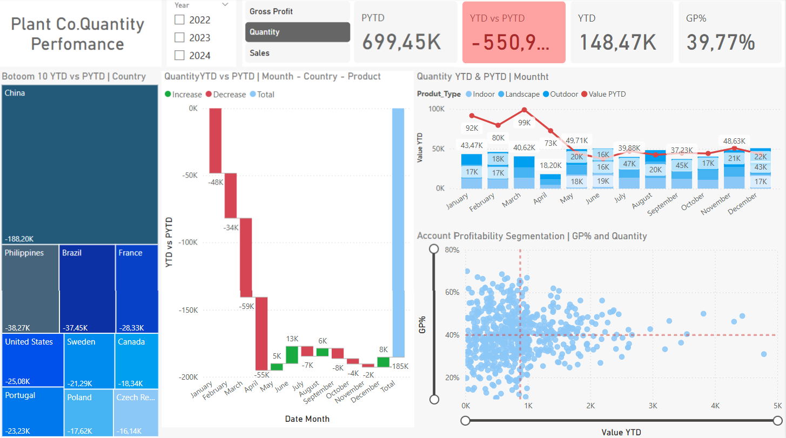
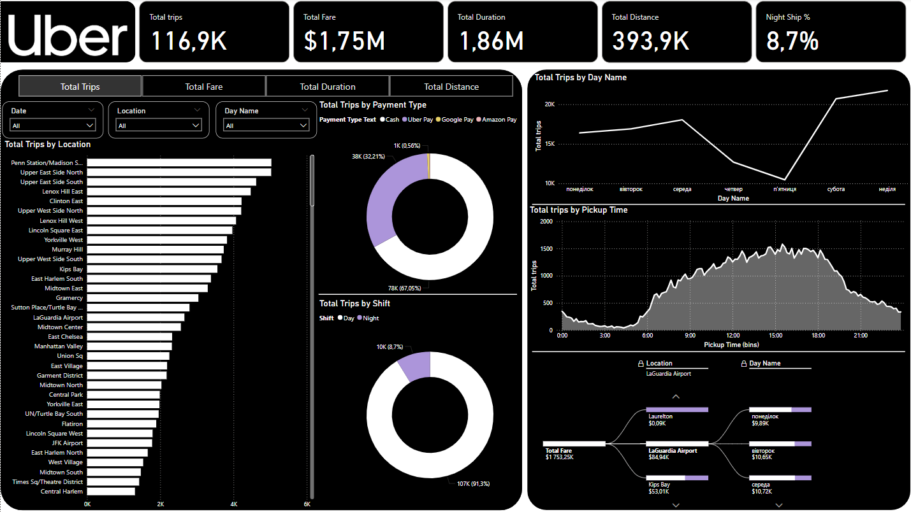
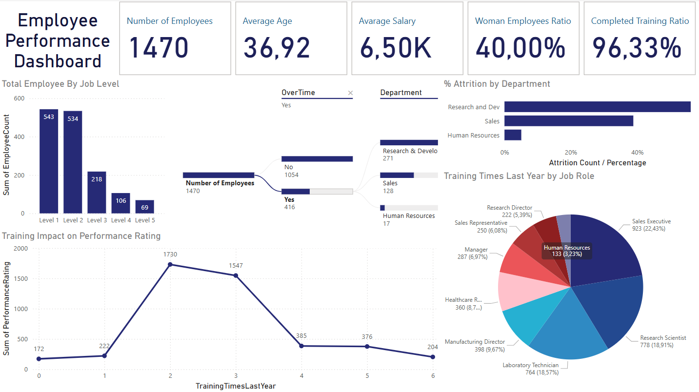

# Business Intelligence Portfolio

Welcome to my BI portfolio repository! This collection showcases interactive dashboards developed using **Power BI** and **Tableau**, covering different business domains and emphasizing data-driven insights through effective storytelling and design.

---

## 🔧 Tools Used
- **Power BI**
- **Tableau**
- Data Modeling (DAX, Relationships)
- Visual Analytics

---

## 📁 Projects Overview

### 1. Plant Shop Quantity Performance Dashboard (Power BI)

**Overview:**  
A dashboard to monitor sales quantity and gross profit performance over time, across countries and product types.

**Key Insights:**  
- Year-to-date vs. prior year comparisons  
- Bottom 10 countries by quantity decline  
- Monthly trends by product category  
- Segmentation of account profitability based on GP% and sales volume 

--- 

### 2. 🚖 Taxi Trips Dashboard (Power BI)

**Overview:**  
A detailed analysis of taxi trips data, focusing on trip volume, fare totals, and time-based trends.

**Key Insights:**  
- Total trips, fare, and distance traveled  
- Trip patterns by location and time of day  
- Analysis by payment type and shift  
- Peak activity periods and popular pickup zones  
---

### 3. HR Dashboard (Power BI)  

**Overview:**  
An HR-focused dashboard highlighting key workforce metrics including employee count, department-wise distribution, attrition, and hiring trends.

**Key Insights:**  
- Workforce composition by role and department  
- Monthly attrition rate and hiring trends  
- Gender and location diversity metrics  

---
